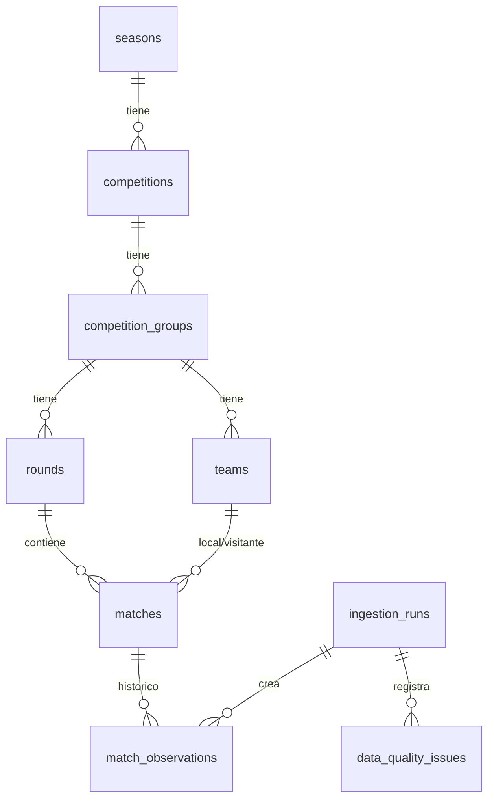

# Modelo de datos (Fase 3)

Claves internas (`id` bigint) + identificadores externos RFFM (`source`, `external_id`). Nunca se identifica por nombre.

## Tablas
- `seasons`, `competitions`, `competition_groups`: únicas por (`source`, `external_id`).
- `rounds`: única por (`group_id`, `external_id`); `visible_label` separado del ID técnico.
- `teams`: únicos por (`group_id`, `external_id`); `name` es el último nombre visto.
- `matches`: último estado conocido; único por (`source`, `external_id`). `scheduled_date`/`scheduled_time` tal como publica RFFM (la hora puede faltar) y `scheduled_at` (UTC) solo si hay ambas.
- `match_observations`: versiones distintas observadas (estado, fechas, marcador, `content_hash`).
- `ingestion_runs`: una fila por ejecución real (estado, contadores, `error_summary`).
- `data_quality_issues`: incidencias por ejecución (partido inválido omitido, jornada desconocida, etc.).
- Campos comunes de entidades: `source`, `external_id`, `created_at`, `updated_at`, `first_seen_at`, `last_seen_at`, `source_url`.

## Restricciones
- Unicidad de temporada, competición, grupo, jornada por grupo, equipo por grupo y partido.
- CHECK: local ≠ visitante; ambos marcadores o ninguno; marcadores ≥ 0; estado válido.
- FK compuestas `(round_id, group_id)` y `(home/away_team_id, group_id)`: un partido no puede usar jornadas ni equipos de otro grupo.

## Idempotencia
Upsert por identificador externo dentro de una transacción. Se compara campo a campo: igual → `last_seen_at`; distinto → actualiza y `updated_at`. Reimportar los mismos datos: 0 nuevos, 0 actualizados, 0 observaciones.
Un error revierte toda la importación; la ejecución queda como `failed` en `ingestion_runs` (transacción aparte).

## Histórico
`content_hash` = SHA-256 de {estado, fecha, hora, marcador local, marcador visitante}; sin `observed_at`, `updated_at` ni timestamps de ejecución. Se crea una observación si el hash difiere del de la última observación del partido (la primera importación crea una por partido; un retorno a un estado anterior también se registra). Cambios en sede o equipos actualizan `matches` pero no generan observación.

## Preview, dry-run e importación real
| Modo | BD | Escribe | Registra ejecución |
|---|---|---|---|
| `preview-import` | no | solo el TXT | no |
| `import-league --dry-run` | sí (transacción descartada) | nada | no |
| `import-league` | sí | sí | sí |

## Actas de partido (Fase 4, migración 0002)
Solo campos observados en un acta real (ver `docs/match-report-discovery.md`).
- `match_reports`: una por partido (`match_id` único; única por `source`+`external_id` = `codacta`).
- `match_report_observations`: una fila por versión de contenido (`content_hash`, único por acta).
  Guarda también lo que dice el acta (marcador, equipos, fecha, campo) **sin tocar `matches`**.
- `players`: solo jugadores con `codjugador` (único por `source`+`external_id`); nombre = último visto.
- `player_team_memberships`: equipo con el que se vio jugar a un jugador en una temporada
  (único por jugador+equipo+temporada). Es una observación, no pertenencia permanente.
- `match_players`, `match_staff`, `match_officials`, `match_events`: filas hijas de una observación
  (únicas por observación+`sequence`; jugador único por observación+equipo+id si hay id).
  `match_players.player_id` es nulo si la fuente no da id: el nombre queda como dato observado.
  Oficiales y técnicos conservan su id externo como texto, sin tabla global de personas.
- Eventos: `goal`/`card`, `minute` nulo si falta, `source_code` y `source_detail` (JSONB) con lo original.

### Identidad e idempotencia
- Nunca se identifica por nombre si existe ID externo; homónimos sin ID no se fusionan.
- Reimportar el mismo contenido (mismo hash): 0 filas nuevas. Contenido distinto: nueva observación
  con sus hijas; las anteriores se conservan (la vigente es la de mayor `observed_at`).
- Discrepancia de marcador/fecha/campo: incidencia `report_value_mismatch`; `matches` no se modifica.
  Se considera fuente vigente el listado hasta revisión; el acta cerrada es la más fiable pero no se
  consolida automáticamente. Equipos/competición/grupo/jornada distintos: error material y rollback.
